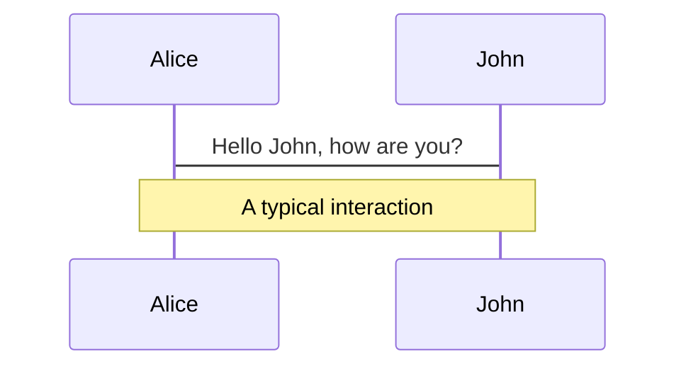
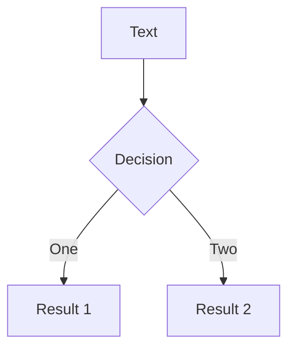
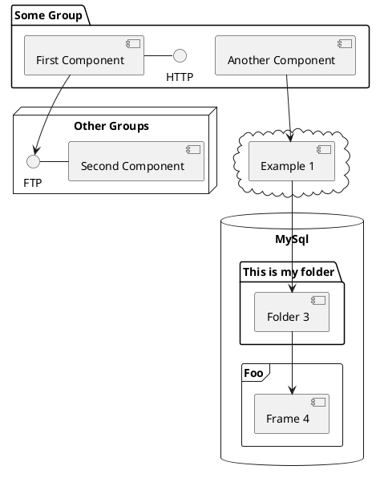

---
# try also 'default' to start simple
theme: unicorn
# random image from a curated Unsplash collection by Anthony
# like them? see https://unsplash.com/collections/94734566/slidev
# background: https://source.unsplash.com/collection/94734566/1920x1080
background: https://images.unsplash.com/photo-1590859808308-3d2d9c515b1a?ixlib=rb-4.0.3&ixid=MnwxMjA3fDB8MHxwaG90by1wYWdlfHx8fGVufDB8fHx8&auto=format&fit=crop&w=1174&q=80
# apply any windi css classes to the current slide
class: "text-center"
# https://sli.dev/custom/highlighters.html
highlighter: shiki
# show line numbers in code blocks
lineNumbers: false
# some information about the slides, markdown enabled
info: |
  ## Slidev Starter Template
  Presentation slides for developers.

  Learn more at [Sli.dev](https://sli.dev)
# persist drawings in exports and build
drawings:
  persist: false
# use UnoCSS
css: unocss
logoHeader: "https://theroadtoenterprise.com/images/logo-400x119.avif"
website: "https://theroadtoenterprise.com"
handle: thomasfindlay94
layout: intro
introImage: "https://theroadtoenterprise.com/images/About.avif"
---

# Best Practices and Patterns for Managing API Requests and States

By Thomas Findlay

---

# About instructor - Thomas Findlay

- Full-Stack Web & Mobile Developer with 10 years of programming experience
- Co-Owner of Findlay Web Tech
- Mentor & Consultant at Codementor.io and Toptal
- The author of "Vue - The Road To Enterprise" & "React - The Road To Enterprise" books
- Technical Writer for Telerik and The Road To Enterprise blogs

---

# Workshop Content - ( 1 / 3 )

- Fetching & Posting data with Axios - the simple way.
- API requests cancellation with Axios.
- How to provide meaningful feedback to the users?
- Questions...

---

# Workshop Content ( 2 / 3 )

- What is the API Layer and what problems does it solve?
- Implementing the API Layer
- API requests cancellation with the API Layer
- Questions...

---

# Workshop Content ( 3 / 3 )

- APIs at scale with API Layer and React-Query
- Bonus - React-Router Loaders
- Questions...

---

# Project Setup

<CodeBlock>
$ git clone https://github.com/ThomasFindlay/react-advanced-workshop-best-practices-and-patterns-for-managing-apis <br />
$ git checkout api-fetch-requests/start <br />
$ npm install <br />
$ npm run dev <br />
</CodeBlock>

---
layout: center
---

# How to Perform API requests in React?

---

# Where can we put the API logic?

- useEffect hook
- callback handlers
- outside of React components
- route loaders and actions (available since React-Router v6.4)
- componentDidMount/componentDidUpdate

---

# Let's start with fetching data

<CodeBlock>
$ git clone https://github.com/ThomasFindlay/react-advanced-workshop-best-practices-and-patterns-for-managing-apis <br />
$ git checkout api-fetch-requests/start <br />
$ npm install <br />
$ npm run dev <br />
</CodeBlock>

---
layout: center
---

# React 18 Strict Mode - Double Requests 

Since React 18 there are double requests in the useEffect

---

# How to deal with double requests in Strict Mode?

1. Leave it as it is, but make sure you cancel requests
2. Move the API request outside of the useEffect - outside of a component or into a callback
3. Deduplicate requests - automatically done by libraries like React-Query, useSWR, RTK Query
4. Turn of the Strict mode

---

# What about sending some data?

<CodeBlock>
$ git checkout api-post-requests/start <br />
</CodeBlock>

---

# Request cancellation with Axios

<CodeBlock>
$ git checkout api-fetch-requests-cancellation/start <br />
</CodeBlock>

---
layout: center
---

# How to provide meaningful feedback to users during API requests?

---

# Boolean flags

```js
const [isLoading, setIsLoading] = useState(false)
const [isError. setIsError] = useState(false)
```

---
layout: center
---

# Let's implement boolean flags

---

# Boolean flags - problems

Each new API requests requires at least two additional states:
```js
const [isLoadingQuotes, setIsLoadingQuotes] = useState(false) 
const [isLoadingQuotesError. setIsLoadingQuotesError] = useState(false)

const [isSubmittingQuotes, setIsSubmittingQuotes] = useState(false) 
const [isSubmittingQuotesError. setIsSubmittingQuotesError] = useState(false)
```

---

# Boolean flags - problems

It's possible to have loading and error states active at the same time

```js
try {
  // Oops, forgot to set the isLoadingQuotesError to false
  setIsLoadingQuotes(true)
  const response = await axios.get('...')
  setIsLoadingQuotes(false)
} catch (error) {
  setIsLoadingQuotesError(true)
}
```

---
layout: center
---

# What to do instead of boolean flags?

---
layout: center
---

# One API Status

IDLE <br />
PENDING <br />
SUCCESS <br />
ERROR <br />

---

# One API Status

```js{all|1-4|6-7|8-14|10|11|12|14|all}
  const IDLE = 'IDLE'
  const PENDING = 'PENDING'
  const SUCCESS = 'SUCCESS'
  const ERROR = 'ERROR'

  const [fetchQuotesStatus, setFetchQuotesStatus] = useState(IDLE)
  const [quotes, setQuotes] = useState([])

  try {
    setFetchQuotesStatus(PENDING)
    const response = await axios.get('...')
    setFetchQuotesStatus(SUCCESS)
  } catch (error) {
    setFetchQuotesStatus(ERROR)
  }
```

---
layout: center
---

# Let's migrate from boolean flags

---
layout: center
---

# Questions?

---
layout: center
---

# What is the API Layer and what problems does it solve?

---

# Using http clients directly in components results in:

- Lack of standardisation and inconsistent implementation
- Server and third-party URLs are all over the application
- Difficult to update the client-side when the server-side endpoint changes

---

# Let's implement the API layer

<CodeBlock>
$ git checkout api-layer/start
</CodeBlock>

---

# Request cancellation with the API layer

<CodeBlock>
$ git checkout api-layer-cancellation/start
</CodeBlock>

---

# Benefits of the API layer

- The API logic is encapsulated inside of the API layer and hides implementation details of the API layer
- Consumers of the API layer only care about importing methods, providing input and receiving output
- Can easily be enhanced with additional logic without affecting the rest of application code
- Much easier to migrate from one http client to another, e.g. from `axios` to `fetch` 

---
layout: center
---

# Questions?

---
layout: center
---

# APIs at scale with API Layer and React-Query

---

# What is React-Query?

- Data fetching and updating server state
- Caching
- Data synchronising
- Deduping multiple requests
- Background updates
- and more...

---

# Let's incorporate React-Query

<CodeBlock>
$ git checkout react-query/start<br /> 
</CodeBlock>

---

# Benefits of React-Query

- Feature-rich with many tools for managing API state
- Opinionated
- Easy to use

---
layout: center
---

# Bonus Content 
## API Layer + React-Query + React-Router Loaders & Actions

---

# What are route the route loaders and what's the big deal?

- Loaders and Actions are new features introduced in React Router 6.4 (Ported from Remix)
- Data fetching and posting is coupled with the router rather than components
- Allows to start loading data immediately upon entering a route instead of waiting for components to render and load. This helps with avoiding the waterfall effect.

--- 
layout: center
---

# Questions?

---
layout: two-cols
---
# The End


- Twitter <br />
  https://twitter.com/thomasfindlay94

- LinkedIn <br />
  https://www.linkedin.com/in/thomas-findlay/

- Codementor <br />
  https://www.codementor.io/@thomas478

- The Road To Enterprise <br />
  https://theroadtoenterprise.com/blog

<div class="mt-8">
  <div class="mb-2">Slides and workshop code:</div>
  <a class="leading-relaxed" target="_blank" rel="noreferrer" href="https://github.com/ThomasFindlay/react-advanced-london-managing-apis">https://github.com/ThomasFindlay/react-advanced-london-managing-apis</a>
</div>
<div class="mt-3">
  <div class="mb-2">Slides:</div>
  <a class="leading-relaxed" target="_blank" rel="noreferrer" href="https://react-advanced-london-slides.vercel.app/">https://react-advanced-london-slides.vercel.app/</a>
</div>

::right::

<div class="right-col mt-16">
  <span class="block mb-4"><span class="font-bold">React - The Road To Enterprise</span> (Coming Dec 2021)</span> 
  <span>Special gift for conference attendees</span>

  <span>35% OFF with code **REACTADVANCED**</span>

  <div class="flex items-center gap-4">
    
    
  </div>
</div>

<!-- Pre-order and get 35% OFF with code  -->
<!-- __REACTADVANCED__ -->
<style>
  .right-col {
    @apply float-right
  }
</style>


---

# What is Slidev?

Slidev is a slides maker and presenter designed for developers, consist of the following features

- 📝 **Text-based** - focus on the content with Markdown, and then style them later
- 🎨 **Themable** - theme can be shared and used with npm packages
- 🧑‍💻 **Developer Friendly** - code highlighting, live coding with autocompletion
- 🤹 **Interactive** - embedding Vue components to enhance your expressions
- 🎥 **Recording** - built-in recording and camera view
- 📤 **Portable** - export into PDF, PNGs, or even a hostable SPA
- 🛠 **Hackable** - anything possible on a webpage

<br>
<br>

Read more about [Why Slidev?](https://sli.dev/guide/why)

<!--
You can have `style` tag in markdown to override the style for the current page.
Learn more: https://sli.dev/guide/syntax#embedded-styles
-->

<style>
h1 {
  background-color: #2B90B6;
  background-image: linear-gradient(45deg, #4EC5D4 10%, #146b8c 20%);
  background-size: 100%;
  -webkit-background-clip: text;
  -moz-background-clip: text;
  -webkit-text-fill-color: transparent;
  -moz-text-fill-color: transparent;
}
</style>

<!--
Here is another comment.
-->

---

# Navigation

Hover on the bottom-left corner to see the navigation's controls panel, [learn more](https://sli.dev/guide/navigation.html)

### Keyboard Shortcuts

|                                                    |                             |
| -------------------------------------------------- | --------------------------- |
| <kbd>right</kbd> / <kbd>space</kbd>                | next animation or slide     |
| <kbd>left</kbd> / <kbd>shift</kbd><kbd>space</kbd> | previous animation or slide |
| <kbd>up</kbd>                                      | previous slide              |
| <kbd>down</kbd>                                    | next slide                  |

<!-- https://sli.dev/guide/animations.html#click-animations -->


<p v-after class="absolute bottom-23 left-45 opacity-30 transform -rotate-10">Here!</p>

---

layout: image-right
image: https://source.unsplash.com/collection/94734566/1920x1080

---

# Code

Use code snippets and get the highlighting directly![^1]

```ts {all|2|1-6|9|all}
interface User {
  id: number;
  firstName: string;
  lastName: string;
  role: string;
}

function updateUser(id: number, update: User) {
  const user = getUser(id);
  const newUser = { ...user, ...update };
  saveUser(id, newUser);
}
```

<arrow v-click="3" x1="400" y1="420" x2="230" y2="330" color="#564" width="3" arrowSize="1" />

[^1]: [Learn More](https://sli.dev/guide/syntax.html#line-highlighting)

<style>
.footnotes-sep {
  @apply mt-20 opacity-10;
}
.footnotes {
  @apply text-sm opacity-75;
}
.footnote-backref {
  display: none;
}
</style>

---

# Components

<div grid="~ cols-2 gap-4">
<div>

You can use Vue components directly inside your slides.

We have provided a few built-in components like `<Tweet/>` and `<Youtube/>` that you can use directly. And adding your custom components is also super easy.

```html
<Counter :count="10" />
```

<!-- ./components/Counter.vue -->
<Counter :count="10" m="t-4" />

Check out [the guides](https://sli.dev/builtin/components.html) for more.

</div>
<div>

```html
<Tweet id="1390115482657726468" />
```

<Tweet id="1390115482657726468" scale="0.65" />

</div>
</div>

<!--
Presenter note with **bold**, *italic*, and ~~striked~~ text.

Also, HTML elements are valid:
<div class="flex w-full">
  <span style="flex-grow: 1;">Left content</span>
  <span>Right content</span>
</div>
-->

---

## class: px-20

# Themes

Slidev comes with powerful theming support. Themes can provide styles, layouts, components, or even configurations for tools. Switching between themes by just **one edit** in your frontmatter:

<div grid="~ cols-2 gap-2" m="-t-2">

```yaml
---
theme: default
---
```

```yaml
---
theme: seriph
---
```


</div>

Read more about [How to use a theme](https://sli.dev/themes/use.html) and
check out the [Awesome Themes Gallery](https://sli.dev/themes/gallery.html).

---

## preload: false

# Animations

Animations are powered by [@vueuse/motion](https://motion.vueuse.org/).

```html
<div v-motion :initial="{ x: -80 }" :enter="{ x: 0 }">Slidev</div>
```

<div class="w-60 relative mt-6">
  <div class="relative w-40 h-40">
    
    
    
  </div>

  <div
    class="text-5xl absolute top-14 left-40 text-[#2B90B6] -z-1"
    v-motion
    :initial="{ x: -80, opacity: 0}"
    :enter="{ x: 0, opacity: 1, transition: { delay: 2000, duration: 1000 } }">
    Slidev
  </div>
</div>

<!-- vue script setup scripts can be directly used in markdown, and will only affects current page -->
<script setup lang="ts">
const final = {
  x: 0,
  y: 0,
  rotate: 0,
  scale: 1,
  transition: {
    type: 'spring',
    damping: 10,
    stiffness: 20,
    mass: 2
  }
}
</script>

<div
  v-motion
  :initial="{ x:35, y: 40, opacity: 0}"
  :enter="{ y: 0, opacity: 1, transition: { delay: 3500 } }">

[Learn More](https://sli.dev/guide/animations.html#motion)

</div>

---

# LaTeX

LaTeX is supported out-of-box powered by [KaTeX](https://katex.org/).

<br>

Inline $\sqrt{3x-1}+(1+x)^2$

Block

$$
\begin{array}{c}

\nabla \times \vec{\mathbf{B}} -\, \frac1c\, \frac{\partial\vec{\mathbf{E}}}{\partial t} &
= \frac{4\pi}{c}\vec{\mathbf{j}}    \nabla \cdot \vec{\mathbf{E}} & = 4 \pi \rho \\

\nabla \times \vec{\mathbf{E}}\, +\, \frac1c\, \frac{\partial\vec{\mathbf{B}}}{\partial t} & = \vec{\mathbf{0}} \\

\nabla \cdot \vec{\mathbf{B}} & = 0

\end{array}
$$

<br>

[Learn more](https://sli.dev/guide/syntax#latex)

---

# Diagrams

You can create diagrams / graphs from textual descriptions, directly in your Markdown.

<div class="grid grid-cols-3 gap-10 pt-4 -mb-6">







</div>

[Learn More](https://sli.dev/guide/syntax.html#diagrams)

---

src: ./pages/multiple-entries.md
hide: false

---

---

layout: center
class: text-center

---

# Learn More

[Documentations](https://sli.dev) · [GitHub](https://github.com/slidevjs/slidev) · [Showcases](https://sli.dev/showcases.html)
